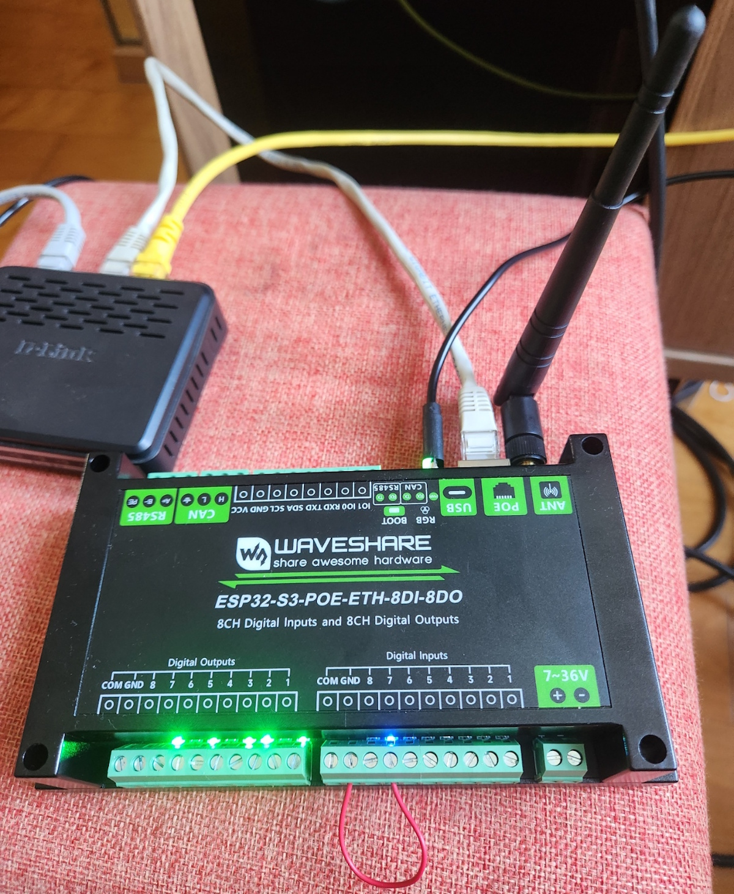
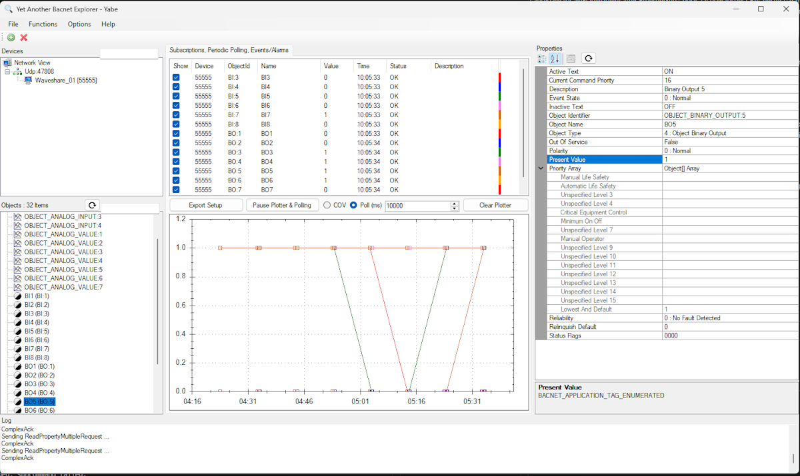

# 📘 BACnet Field Controller Firmware for Waveshare ESP32-S3-POE-ETH-8DI-8DO

## 📌 Overview

This project ports an existing BACnet controller application to the **Waveshare ESP32-S3-POE-ETH-8DI-8DO** platform.

https://www.waveshare.com/wiki/ESP32-S3-POE-ETH-8DI-8DO

It provides a fully operational **multi-transport BACnet gateway** with deterministic transport arbitration between:

- BACnet/IP over Ethernet (W5500)
- BACnet/IP over WiFi (ESP32 STA)
- BACnet MS/TP (RS485 fallback)

The system is designed for industrial field deployment with resilient multi-network operation.

---

# 🟦 1. Hardware Specification

## 1.1 Platform Overview

This project runs on the **Waveshare ESP32-S3-POE-ETH-8DI-8DO** hardware platform.

### Core Hardware Components

- ESP32-S3 MCU  
- W5500 Ethernet controller (SPI)  
- TCA9554 I/O expander (I²C)  
- Opto-isolated digital inputs  
- Relay outputs  
- RS485 transceiver (MS/TP)  
- WS2812 RGB status LED  
- Passive buzzer  
- Optional RTC (PCF85063)  
- Optional SD card interface  

### Photos

  

---

## 1.2 Ethernet Interface (W5500)

| Signal | GPIO |
|--------|------|
| MOSI   | 13   |
| MISO   | 14   |
| SCK    | 15   |
| CS     | 16   |
| INT    | 12   |
| RESET  | 39   |

- DHCP supported  
- Static IP supported  
- BACnet/IP over UDP (port 47808)  

---

## 1.3 RS485 (BACnet MS/TP)

| Signal | GPIO |
|--------|------|
| TX     | 17   |
| RX     | 18   |
| DE/RE  | 21   |

- Half-duplex RS485  
- Automatic direction control  
- BACnet MS/TP supported  

---

## 1.4 Digital Inputs (DI1–DI8)

| Input | GPIO |
|------|------|
| DI1  | 4    |
| DI2  | 5    |
| DI3  | 6    |
| DI4  | 7    |
| DI5  | 8    |
| DI6  | 9    |
| DI7  | 10   |
| DI8  | 11   |

- Opto-isolated inputs  
- Direct GPIO sampling  
- Mapped to BACnet Binary Inputs (BI1–BI8)  

---

## 1.5 Relay Outputs (DO1–DO8)

Controlled via **TCA9554 I/O expander**

| Property | Value |
|----------|------|
| Address  | 0x20  |

- Active-low relays  
- Controlled via `waveshare_write_do()`  
- Mapped to BACnet Binary Outputs (BO1–BO8)  

---

## 1.6 User Interface

| Device   | GPIO |
|----------|------|
| RGB LED  | 38   |
| Buzzer   | 46   |

---

## 1.7 Optional Hardware (Not Implemented)

| Module         | Status |
|----------------|--------|
| RTC (PCF85063) | Not used |
| SD Card        | Not used |
| CAN Bus        | Not used |

---

# 🟨 2. Firmware Architecture

## 2.1 System Overview

The firmware is built around a **centralized BACnet Finite State Machine (FSM)**.

Core file:

- `main/bacnet_system_fsm.c`

---

## 2.2 FSM States

- BOOT  
- PERIPHERAL_INIT  
- OBJECTS_INIT  
- NETWORK_WAIT  
- TRANSPORT_SELECT  
- BACNET_ACTIVE  

---

## 2.3 Transport System

Supported transports:

- BACnet/IP over Ethernet (W5500)  
- BACnet/IP over WiFi (ESP32 STA)  
- BACnet MS/TP (RS485 fallback)  

### Transport Priority

1. Ethernet (preferred when usable)
2. WiFi (ESP32 STA)
3. MS/TP (fallback when no IP transport is usable)

The system continuously evaluates interface availability and selects the optimal transport at runtime.

Both Ethernet and WiFi may be simultaneously:

- Connected
- IP-valid
- Operational

Only one is selected as the active BACnet/IP transport at any time.

---

## 2.4 Event System

All system transitions are driven by a **queued event model**.

### Events

- ETH_UP / ETH_DOWN  
- WIFI_UP / WIFI_DOWN  
- OBJECTS_READY  
- MSTP_READY  

### Execution Model

- Events processed via FreeRTOS queue  
- Reconciliation loop every 500 ms  

---

## 2.5 BACnet/IP Behavior

- UDP socket on port 47808  
- BBMD support enabled  
- I-Am broadcast on transport activation  
- Dynamic transport binding based on FSM-selected interface (Ethernet or WiFi)

---

## 2.6 Memory Architecture

### Key RAM Consumers

- BACnet object buffers (AV/BV descriptions)  
- TSM transaction list  
- COV subscription table  
- Network stacks (WiFi, Ethernet, MS/TP)  

### Optimizations Applied

- Per-object storage model for AV/BV names/descriptions  
- Reduced global scratch buffers  

---

# 🟩 3. Runtime Behavior & Validation

## 3.1 Boot Sequence

1. Peripheral initialization  
2. Object database initialization  
3. Network subsystem start  
4. Transport selection  
5. BACnet ACTIVE state  

---

## 3.2 Transport Selection Model

The system does not implement failover based solely on failure conditions.

Instead, it uses continuous arbitration:

- Ethernet may be preferred when available
- WiFi remains available concurrently
- MS/TP is used when no IP transport is usable

Selection is based on:

- Link status
- IP validity
- FSM priority rules

---

## 3.3 Dynamic Transport Arbitration

When network conditions change:

- FSM reevaluates Ethernet and WiFi
- A new active transport may be selected
- If selection changes:
  - UDP socket is rebound
  - BACnet/IP stack is reinitialized on selected interface
  - I-Am is emitted for the active transport change

---

## 3.4 BACnet Discovery (YABE)

Supported:

- Who-Is / I-Am  
- Device object discovery  
- Object List read  

Behavior:

- Device becomes discoverable in YABE when BACnet/IP is active and bound to a reachable network interface  
- Visibility depends on active transport and network reachability  

---

## 3.5 Stability Properties

Verified behaviors:

- No transport oscillation under stable network conditions  
- Single receive task instance  
- No BBMD duplicate registration  
- No socket duplication during migration  
- Stable heap behavior under repeated transitions  

---

## 3.6 Current Validation Status

### Verified

- Ethernet BACnet/IP operation  
- WiFi BACnet/IP operation  
- Deterministic transport arbitration (Ethernet ↔ WiFi)  
- MS/TP initialization path  
- YABE discovery (post-migration)  
- Object read/write operations  
- BBMD registration  
- Stable FSM transitions  

---

### Pending Field Validation

- Long-duration stress testing (10+ failover cycles)  
- Explicit I-Am logging verification in field trace  
- MS/TP interoperability testing with JCI NAE  

---

# 🧭 4. System Design Summary

This firmware implements a deterministic BACnet field controller architecture with:

- Central FSM-based orchestration  
- Event-driven transport arbitration  
- Multi-transport BACnet/IP support  
- MS/TP fallback capability  
- Runtime-safe interface selection and operation  

Designed for:

> Industrial BACnet gateway deployment with resilient multi-network operation.