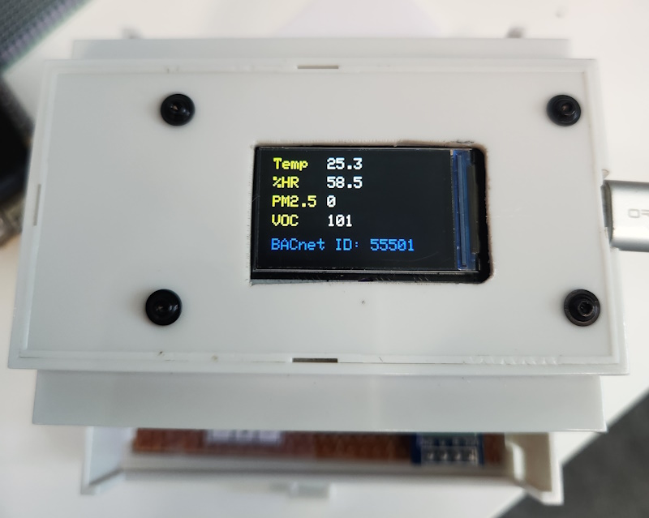
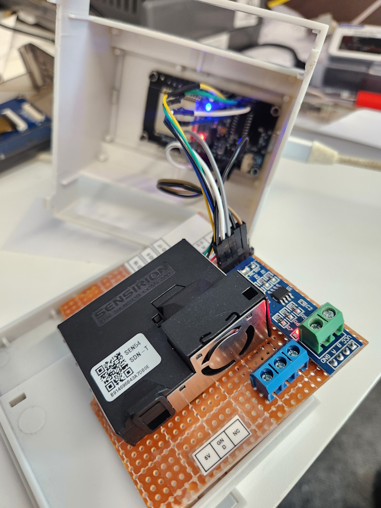
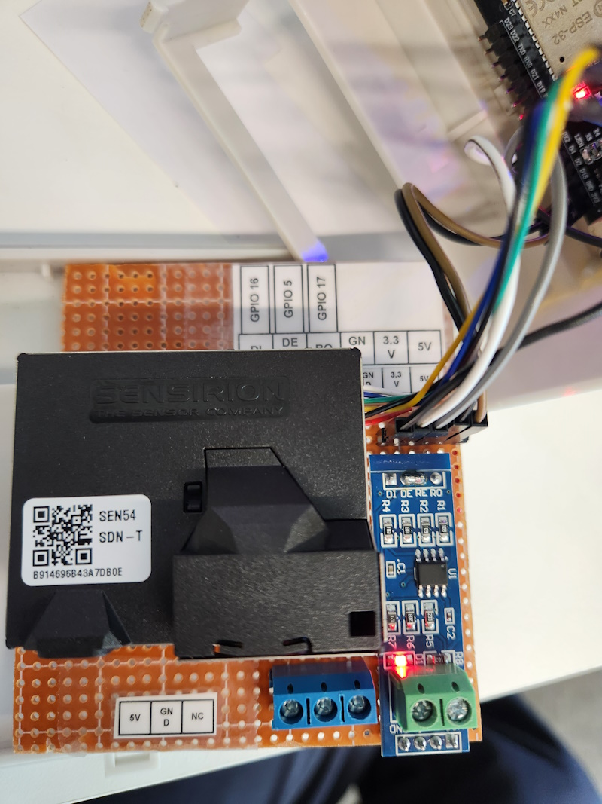
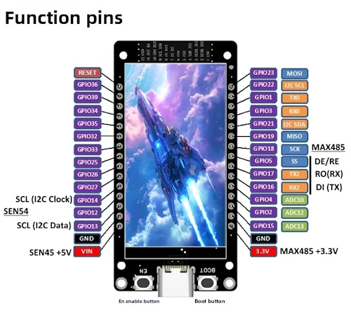

# ESP3-S3 BACnet device with SEN54 Air Quality Sensor

ESP32-S3 based BACnet/IP device featuring 23 BACnet objects: 7 Analog Values, 4 Binary Values, 4 Analog Inputs, 4 Binary Inputs, and 4 Binary Outputs. .

It can simultaneously connect the BACnet device through WiFi (BACnet/IP), WiFi to Ethernet bridge, and MS/TP 

## Features

- **BACnet/IP Protocol**: Full BACnet/IP stack implementation
- **BACnet MS/TP**: RS485 MS/TP support alongside BACnet/IP (dual stack)
- **Live Display**: Real-time monitoring of BACnet objects on 170x320 TFT display
- **23 BACnet Objects**:
  - 7 Analog Values (AV1-7) - read/write with COV and NVS persistence
  - 4 Binary Values (BV1-4) - read/write with COV and NVS persistence
  - 4 Analog Inputs (AI1-4) - sensor inputs with COV and NVS persistence
  - 8 Binary Inputs (BI1-4) - binary states with COV and NVS persistence
  - 8 Binary Outputs (BO1-4) - writable control outputs with COV and NVS persistence
- **Writable Metadata**: Object `Name` and `Description` are writable for AV/BV/AI/BI/BO
- **WiFi Connectivity**: ESP32 with built-in WiFi for BACnet/IP communication
- **Arduino Framework**: Leverages Arduino ecosystem for easy hardware control
- **Change of Value (COV)**: Implements BACnet COV notifications for efficient real-time updates
- **Persistent Storage**: Attribute values modifiable from BACnet supervisor are automatically saved to ESP32 non-volatile memory (NVS) for retention across power cycles
- **NVS Override**: When `USER_OVERRIDE_NVS_ON_FLASH=1`, NVS is erased on boot and all values reset to defaults
- **Centralized Configuration**: User settings are centralized in [main/User_Settings.c](main/User_Settings.c)
- **Air Quality Monitoring**: SEN54 sensor with PM2.5/PM1.0/PM4.0/PM10, temperature, humidity, and VOC/NOx index with automatic BACnet integration


## Photos





## Hardware Components

### ST7789 TFT Display
- **Resolution**: 170x320 pixels
- **Driver**: TFT_eSPI with custom ST7789 setup

### SEN54 Air Quality Sensor
- **Model**: Sensirion SEN54
- **Communication**: I2C (address 0x69, 100 kHz)
- **Connections**:
  - SDA → ESP32 GPIO13
  - SCL → ESP32 GPIO14
  - Power: 3.3V or 5V
  - GND: ESP32 GND
- **Measurements**:
  - PM1.0, PM2.5, PM4.0, PM10 (µg/m³)
  - Temperature (°C) → mapped to **Analog Value 1**
  - Relative Humidity (%RH) → mapped to **Analog Value 2**
  - PM2.5 → mapped to **Analog Value 3**
  - VOC Index (1–500) → mapped to **Analog Value 4**
  - PM1.0 → mapped to **Analog Value 5**
  - PM4.0 → mapped to **Analog Value 6**
  - PM10 → mapped to **Analog Value 7**
  - NOx Index (1–500, available via API)
- **BACnet Mapping**: Modify `sen54_task` in [main/main.c](main/main.c) to change which measurements map to which AV objects.
- **Update Frequency**: 2-second intervals
- **Features**:
  - CRC-8 validation on all I2C responses (Sensirion polynomial 0x31)
  - Sensor disconnect detection with BACnet error indication (-1 value)
  - Thread-safe FreeRTOS mutex-protected data

### WiFi Connectivity
- Built-in ESP32 WiFi for BACnet/IP communication
- Configured via [main/User_Settings.c](main/User_Settings.c)
- Set your SSID/password in [main/User_Settings.c](main/User_Settings.c) for your environment
- Static IP option in [main/User_Settings.c](main/User_Settings.c). Set `USER_WIFI_USE_STATIC_IP` to 1 or 0

### BACnet MS/TP (RS485)
- **Transceiver**: MAX485 or equivalent RS485 converter
- **UART**: UART2
- **Connections**:
  - DE/RE → ESP32 GPIO5
  - DI (TX) → ESP32 GPIO16
  - RO (RX) → ESP32 GPIO17
- **Baud Rate**: 38400 (default)
- **MS/TP Settings**: MAC 21, Max Master 127, Max Info Frames 80
- **Discovery**: Some controllers (e.g., NAE) require manual add on the MS/TP field bus

## GPIO Summary

| Pin     | Component   | Signal              | Definition |
|---------|-------------|---------------------|------------|
| GPIO 13 | SEN54       | SDA (I2C Data)      | [components/sen54/sen54.h](components/sen54/sen54.h)
| GPIO 14 | SEN54       | SCL (I2C Clock)     | [components/sen54/sen54.h](components/sen54/sen54.h)
| GPIO 2  | TFT Display | DC (Data/Command)   | [components/TFT_eSPI/User_Setup.h](components/TFT_eSPI/User_Setup.h)
| GPIO 4  | TFT Display | RST (Reset)         | [components/TFT_eSPI/User_Setup.h](components/TFT_eSPI/User_Setup.h)
| GPIO 15 | TFT Display | CS (Chip Select)    | [components/TFT_eSPI/User_Setup.h](components/TFT_eSPI/User_Setup.h)
| GPIO 18 | TFT Display | SCLK (SPI Clock)    | [components/TFT_eSPI/User_Setup.h](components/TFT_eSPI/User_Setup.h)
| GPIO 23 | TFT Display | MOSI SDA (SPI Data) | [components/TFT_eSPI/User_Setup.h](components/TFT_eSPI/User_Setup.h)
| GPIO 32 | TFT Display | BACKLIGHT           | [components/TFT_eSPI/User_Setup.h](components/TFT_eSPI/User_Setup.h)
| GPIO 5  | MAX485      | DE/RE               | [main/mstp_rs485.c](main/mstp_rs485.c)
| GPIO 16 | MAX485      | DI (TX)             | [main/mstp_rs485.c](main/mstp_rs485.c)
| GPIO 17 | MAX485      | RO (RX)             | [main/mstp_rs485.c](main/mstp_rs485.c)


## Build Requirements

- ESP-IDF v5.5.x
- Python 3.11+
- xtensa-esp-elf toolchain

## Building

```bash
cd <project-folder>
idf.py build
```

## Flashing

```bash
idf.py flash -p COM3
```

Or use the provided build/flash tasks in VS Code.

## Monitoring Serial Output

```bash
idf.py monitor -p COM3
```

## Configuration

### Display Driver Settings

Display initialization and pin mapping are configured in [components/TFT_eSPI/User_Setup.h](components/TFT_eSPI/User_Setup.h) and [main/display.cpp](main/display.cpp), including:

- `TFT_MOSI 23`
- `TFT_SCLK 18`
- `TFT_CS 15`
- `TFT_DC 2`
- `TFT_RST 4`
- `TFT_BL 32`
- `tft.setRotation(1)`

### FreeRTOS Configuration

Arduino framework requires FreeRTOS tick rate of 1000Hz. This is set in [sdkconfig](sdkconfig):

```
CONFIG_FREERTOS_HZ=1000
```

### User Settings (Centralized Configuration)

Most user-configurable settings are centralized in [main/User_Settings.c](main/User_Settings.c) and declared in [main/User_Settings.h](main/User_Settings.h), including:

- WiFi SSID/password and static IP settings
- BACnet Device Instance and BBMD registration
- BACnet/IP and MS/TP enable flags (`USER_ENABLE_BACNET_IP_ETHERNET`, `USER_ENABLE_BACNET_IP_WIFI`, `USER_ENABLE_BACNET_MSTP`)
- MS/TP parameters (MAC, baud rate, max master, max info frames)
- Default object names, descriptions, units, and initial values

### BACnet Object Configuration

- **Analog Values (AV1-7)**: Configure names, descriptions, units, and initial values in [main/User_Settings.c](main/User_Settings.c)

- **Binary Values (BV1-4)**: Configure names, descriptions, active/inactive text, and initial states in [main/User_Settings.c](main/User_Settings.c)

- **Analog Inputs (AI1-4)**: Configure names, descriptions, units, and COV increments in [main/User_Settings.c](main/User_Settings.c). Read-only inputs suitable for sensor integration.

- **Binary Inputs (BI1-4)**: Configure names, descriptions, active/inactive text in [main/User_Settings.c](main/User_Settings.c). Read-only binary states.

- **Binary Outputs (BO1-4)**: Configure names, descriptions, active/inactive text, and initial states in [main/User_Settings.c](main/User_Settings.c). Writable control outputs with priority support.

### Sensor Data Mapping

- **SEN54 Parameters**: Select which sensor measurement (PM1.0, PM2.5, PM4.0, PM10, temperature, humidity, VOC index, or NOx index) to map to each Analog Value object in [main/main.c](main/main.c) — look for the `sen54_task()` function. Current default mapping: AV1=Temperature, AV2=Humidity, AV3=PM2.5, AV4=VOC Index, AV5=PM1.0, AV6=PM4.0, AV7=PM10.

## Architecture

### Components

- **[components/bacnet-stack](components/bacnet-stack)** - BACnet/IP stack (modified from bacnet-stack/bacnet-stack)
- **[components/sen54](components/sen54)** - Sensirion SEN54 I2C driver
- **[components/Adafruit_BusIO](components/Adafruit_BusIO)** - Adafruit BusIO support library
- **[components/Adafruit_GFX_Library](components/Adafruit_GFX_Library)** - Adafruit graphics primitives
- **[components/Adafruit_ST7735_and_ST7789_Library](components/Adafruit_ST7735_and_ST7789_Library)** - Adafruit ST77xx driver library
- **[main](main/)** - Application code
  - `main.c` - BACnet initialization and main loop
  - `analog_value.c/h` - Analog Value object creation and NVS persistence
  - `binary_value.c/h` - Binary Value object creation and NVS persistence
  - `analog_input.c/h` - Analog Input object creation and NVS persistence
  - `binary_input.c/h` - Binary Input object creation and NVS persistence
  - `binary_output.c/h` - Binary Output object creation and NVS persistence
  - `display.cpp` - TFT display driver
  - `wifi_helper.c` - WiFi configuration helpers

### Display Layout

| Item | Type | Display |
|------|------|---------|
| AV1 | Analog Value | Numeric (1 decimal) |
| AV2 | Analog Value | Numeric (1 decimal) |
| AV3 | Analog Value | Numeric (0 decimals) |
| AV4 | Analog Value | Numeric (0 decimals) |
| BV1 | Binary Value | ON/OFF + Status Dot (Blue=OFF, Green=ON) |
| BV2 | Binary Value | ON/OFF + Status Dot (Blue=OFF, Green=ON) |
| BV3 | Binary Value | ON/OFF + Status Dot (Blue=OFF, Green=ON) |
| BV4 | Binary Value | ON/OFF + Status Dot (Blue=OFF, Green=ON) |

## BACnet Integration

The device broadcasts its Device ID and manages BACnet objects that can be read/written by any BACnet/IP or BACnet MS/TP client (e.g., YABE, Tridium Niagara, Metasys).

### BACnet Objects Exposed

- **Device**: 55501 (configurable in [main/User_Settings.c](main/User_Settings.c))
- **Analog Values**: Instance 1, 2, 3, 4, 5, 6, 7
- **Binary Values**: Instance 1, 2, 3, 4
- **Analog Inputs**: Instance 1, 2, 3, 4
- **Binary Inputs**: Instance 1, 2, 3, 4
- **Binary Outputs**: Instance 1, 2, 3, 4

## Modifications to bacnet-stack

This project uses the official bacnet-stack with the following modifications:

- **[components/bacnet-stack/](components/bacnet-stack/)** - Configured as ESP-IDF component
- Simplified for embedded systems (reduced features, optimized for ESP32)
- WiFi-based BACnet/IP instead of Ethernet

For a list of specific changes, see [BACNET_STACK_CHANGES.md](BACNET_STACK_CHANGES.md) (if available).

## Development Notes

### Display Boundary Constants

The display code uses boundary constants for easy layout modification:

```c
#define DISP_X0    0
#define DISP_Y0    0
#define DISP_X1    319
#define DISP_Y1    169
#define DISP_WIDTH 320
#define DISP_HEIGHT 170
```

Position all elements relative to these constants to avoid hardcoding coordinates.

## Troubleshooting

### Display orientation or color issues
If display output looks mirrored, rotated, or has swapped colors, adjust ST7789 init parameters and rotation in [main/display.cpp](main/display.cpp) and recompile.

### WiFi connection fails
Check SSID/password in [main/User_Settings.c](main/User_Settings.c), then verify WiFi init/connection flow in [main/wifi_helper.c](main/wifi_helper.c).

### Linker errors with Arduino
Ensure `CONFIG_FREERTOS_HZ=1000` is set in [sdkconfig](sdkconfig) and rebuild with `idf.py fullclean && idf.py build`.


## References

- [ESP-IDF Documentation](https://docs.espressif.com/projects/esp-idf/en/stable/)


